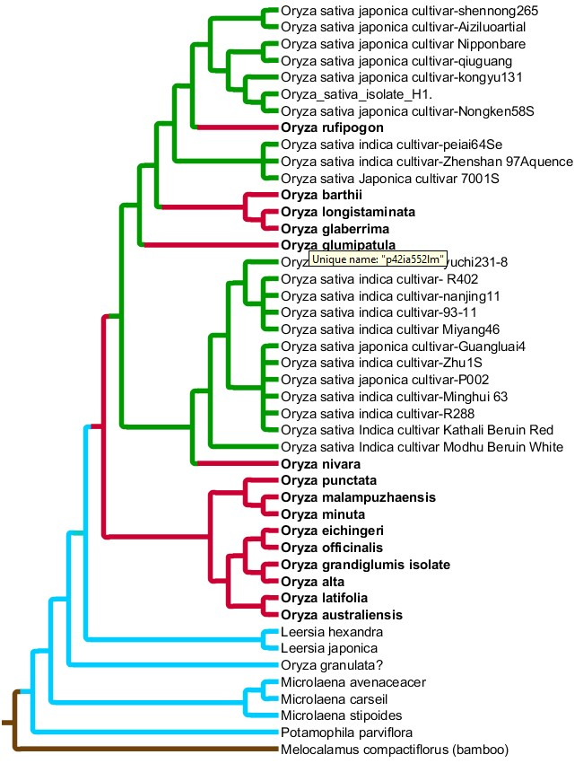
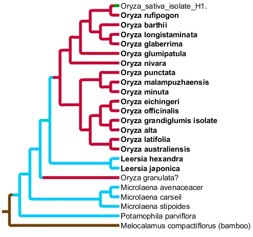
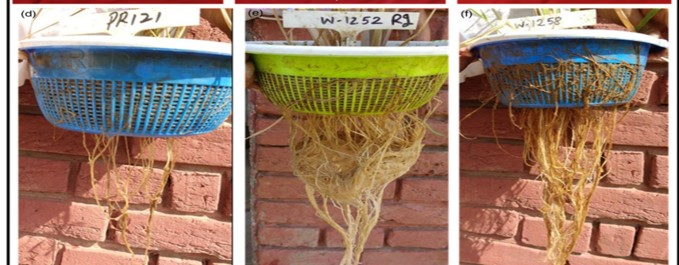
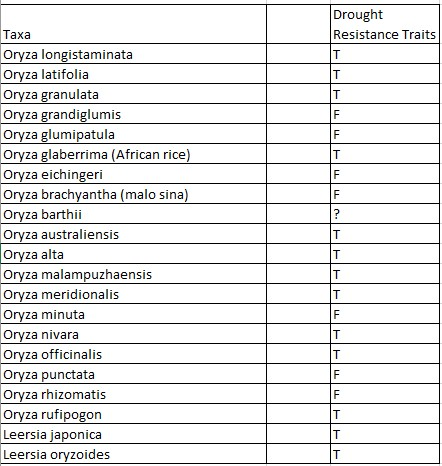
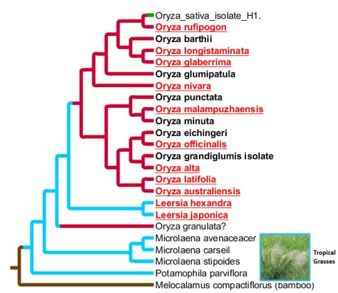

|    Oryza *sativa* (rice) is one of the highest consumed foods, with |approximately 477 million metrics tons consumed globally (2016/2017)(14). With the U.S. consuming about 3.85 million metric tons, and China consuming 146 million metric tons of milled rice per |year(1), it is and will be an important crop not only for the future of the U.S., but the whole world.  With an everchanging climate and population, the water supply is becoming more limited; urban surface water deficit of 1,386-6764 million m^3 has been predicted by the year 2050. (2)(3) Breeding plants that can withstand shortages of water while keeping yields high is a must. Drought stress is a major abiotic factor restricting rice production, not only in rainfed |systems but also modern watering systems. Developing rice cultivars that have drought tolerance and high yield characteristics will help to address these issues. 
|  
|    With 120,000 genotypes of Oryza *sativa*and Oryza *glaberrima*  being held in gene banks, rice genetic diversity is still limited |compared to wild Oryza species.(5) By determining the closest relatives of O.*sativa* and picking the ones that contain drought resistance traits new prospects for crosses can be utilized to make new drought resistance cultivars. Many inquiries have been done to identify potential wild Oryza species that may be used for breeding |in drought resistance into O. *sativa* cultivars, but little has been done to determine the evolution of drought tolerance.
|  
|    This research will focuse on determineing the drought tolerance |relatives closest to O. *sativa* by building a phylogenetic tree. This was done with 45 taxa that have been determined by BLAST search. The search was done using combined ITS1, ITS2, and 5.8S of the O. *sativa* isolate H1 nucleotide sequences. From the results only the closest results were used (90% and up). This process was done using MEGA alignment blast search. The taxa where than aligned using Muscle (-400.0 gap open and 0 for gap extend). The phylogenetyic tree was built using R and various Phylogenetic packages, sauch as ape, phangorn and ggtree.
___

# Analysis and Results

Load Libraries
```{r, warning=FALSE,message=FALSE}
library(Biostrings)
library(ggplot2)
library(ape)
library(tidyverse)
library(ggtree)
```
|
|   The UPGMA Maximum Likely Tree was built using GTR+G model along with bootstrap test(500 replicants). 
For Tree code see links below or go to websight for all project files: [https://github.com/Joscif/Joscif.github.io/tree/master/RESEARCH/Phylo.Proj](https://github.com/Joscif/Joscif.github.io/tree/master/RESEARCH/Phylo.Proj)

[01_Build_Ory_Tree](http://joscif.github.io/RESEARCH/Phylo.Proj/01_Build_Ory_Tree.R)

[02_Tree2](http://joscif.github.io/RESEARCH/Phylo.Proj/02_Tree2.R)


### Tree analysis
```{r, warning=FALSE, message=FALSE}
tree<- read.tree("./TREE/ORY_R_tree.nwk")

tree1 <-ggtree(tree, branch.length='none',root.position =44, size=1.1)+
  geom_tiplab(align = TRUE, linesize = 0.5)+ 
  coord_cartesian(clip = 'off') + 
  theme_tree2(plot.margin=margin(0, 240, 2, 6))+ ggtitle('Oryza_UPGMA_TREE')

tree1
```


From looking at the tree above we see that the O.*sativa* cultivars don't seem to fit into the tree properly. Node 67 and 53 subtrees look like they should be collapsed.  The Tree was than exported as nwk (Phylo.Proj/ORZY_TREE.nwk) and edited using TreeGraph2 software for further visualization.

-Green= *O.sativa* cultivars.

-Red = Wild Oryza rekatives.

-Blue = Other tropical wild rices.

-Brown = Rooted Taxa.

<div style= "float:middle;position: relative;top:30px">
```{r, out.width = "600px",echo=FALSE,fig.cap="TreeGraph2 edited Oryza Tree."}

```


Tree brenches have been colored to show how the O.*sativa* cultivars are distorting the wild Oryza relatives (red). By removing all the cultivars except for the reference isolate H1, we cane better determine the evolutional relationship between the wild Oryza cultivars, O. *sativa* and other tropical grasses.

<div style= "float:middle;position: relative;top:30px">
```{r, out.width = "600px",echo=FALSE,fig.cap="TreeGraph2 edited Oryza Tree-O.sativa cultivar collapse."}

```

|
|   
|   The new tree gives a more accurate picture of Oryza phylogeny and
comparison of O.sativa to the (Red) wild relatives. It is clear that the red is more closely related to O.sativa than the black group. The exception to this is O. granulata, which appears between the Leersia and Microlaena taxa. Next it must be determined which wild relatives contain drought tolerance traits.

|
|
|
|

### Drout Tolerance

|
|   Due to the inability to do an actual study cultivating and testing phenotypic and genomic traits that confer drought resistance, prior studies must suffice. Drought tolerance is controlled by many phenotypic factors, such as Stomatal conductance, root architecture, branching pattern, leaf rolling and plant height. (4) A Paper published in 2017 reports the findings of identifying drought tolerance in Oryza longistaminata, O. officinalis, O. latifolia, and various O. rufipogon subspecies using root architecture and leaf rolling. (7) 


```{r, out.width = "600px",echo=FALSE}

```


Further research has shown what wild Oryza relatives have potential to contribute drought resistance traits to new O.sativa cultivars. (see table)(8)(10)(11)(12)(13). The following chart shows which species have been verified to have drought tolerance traits.

*T=True, 
*F=False,
*?=Unknown
<div style= "float:middle;position: relative;top:30px">
```{r, out.width = "600px",echo=FALSE}

```


Taking this data and applying it to our tree we can see the evolution of drought tolereance.

*Red underlined taxa= drought tolerance traits.


```{r, out.width = "600px",echo=FALSE}

```

|
|
|
|


### Conclusion


|
|   From analyzing past research and the tree above it is supported that drought resistance arose independently. Nine of the species that have been verified drought resistant appear to have all evolved this trait independently. It is posible that this trait was gained in the common ancestor of Leersia and Oryza but lost in some of the Oryza species, as the tree seems to portray but, the opposite is supported by prior research showing that the drought resistance traits in some species are phynotipically different. Supporting the conclusion that many drought tolerance traits such as root arcitecture, leaf curling and stomota closing  behaviors all arose independitly. 
|
|   Moving forward, this data can be taken and used for breeding new rice cultivars. By taking the closest drought resistant relatives of O.*sativa*, such as O. *rufipogon* and O.*longistaminata*, crosses should be easier to conduct. More research and experimental analysis will need to be done to verifiy this though. In addition, using specific drought tolerance traights for specific enviroments is an other strategy to create new drought resistance cultivars.
|
|
|
|


### Citations
 
1. Laporte, John. “Topic: Rice.” Www.statista.com, M. Shahbandeh, 15 Nov. 2007, www.statista.com/topics/1443/rice/.

2. Flörke, M., Schneider, C., & McDonald, R. I. (2018). Water competition between cities and agriculture driven by climate change and urban growth. Nature Sustainability, 1(1), 51–58. https://doi.org/10.1038/s41893-017-0006-8.

3. World Bank. Databank: Agricultural Land (% of Land Area). Available online: https://data.worldbank.org/indicator/AG.LND.AGRI.ZS (accessed on 5 May 2017).

4. Kamoshita, A., Babu, R. C., Boopathi, N. M., & Fukai, S. (2008). Phenotypic and genotypic analysis of drought-resistance traits for development of rice cultivars adapted to rainfed environments. Field Crops Research, 109(1), 1–23. https://doi.org/10.1016/j.fcr.2008.06.010.

5. Atwell, B. J., Wang, H., & Scafaro, A. P. (2014). Could abiotic stress tolerance in wild relatives of rice be used to improve Oryza sativa? Plant Science, 215–216, 48–58. https://doi.org/10.1016/j.plantsci.2013.10.007

6. Wickneswari, R., Bhuiyan, M. A. R., Kalluvettankuzhy K., S., Lim, L. S., Thomson, M. J., Narimah, Md. K., & Abdullah, Md. Z. (2012). Identification and Validation of Quantitative Trait Loci for Agronomic Traits in Advanced Backcross Breeding Lines Derived from Oryza rufipogon × Oryza sativa Cultivar MR219. Plant Molecular Biology Reporter, 30(4), 929–939. https://doi.org/10.1007/s11105-011-0404-4

7. Neelam, K., Sahi, G. K., Kumar, K., & Singh, K. (2018). Identification of drought stress tolerance in wild species germplasm of rice based on leaf and root morphology. Plant Genetic Resources: Characterization and Utilization, 16(4), 289–295. https://doi.org/10.1017/S1479262117000284

8. Sarla, N., & Swamy, B. P. M. (2005). Oryza glaberrima: A source for the improvement of Oryza sativa. Current Science, 89(6), 955–963. JSTOR.

9. Ikehashi, H. (2009). Why are There Indica Type and Japonica Type in Rice? — History of the Studies and a View for Origin of Two Types. Rice Science, 16(1), 1–13. https://doi.org/10.1016/S1672-6308(08)60050-5

10. Singh, V. P. (1996). Physiology of Stress Tolerance in Rice: Proceedings of the International Conference on Stress Physiology of Rice, 28 Feb-5 Mar 1994, Lucknow, U.P. India. Int. Rice Res. Inst.

11. Menguer, P. K., Sperotto, R. A., & Ricachenevsky, F. K. (2017). A walk on the wild side: Oryza species as source for rice abiotic stress tolerance. Genetics and Molecular Biology, 40(1 suppl 1), 238–252. https://doi.org/10.1590/1678-4685-gmb-2016-0093

12. Scafaro, A. P., Haynes, P. A., & Atwell, B. J. (2010). Physiological and molecular changes in Oryza meridionalis Ng., a heat-tolerant species of wild rice. Journal of Experimental Botany, 61(1), 191–202. https://doi.org/10.1093/jxb/erp294

13. Thanh, P. T., Sripichitt, P., Chanprame, S., & Peyachoknagul, S. (n.d.). Transfer of Drought Resistant Character from Wild Rice (Oryza meridionalis and Oryza nivara) to Cultivated Rice (Oryza sativa L.) by Backcrossing and Immature Embryo Culture. 13.

14.	Laporte, John. “Topic: Rice.” Www.statista.com, M. Shahbandeh, 15 Nov. 2007, www.statista.com/topics/1443/rice/.
